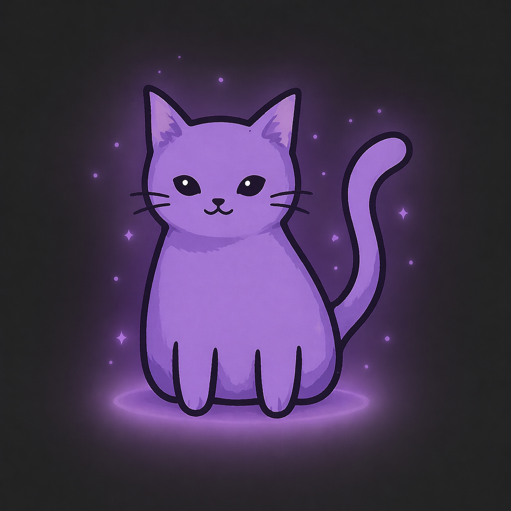

# Lyra



Мобильное приложение для общения в учебных группах в реальном времени. Любой участник может создать комнату и стать её хостом — встроенный сервер поднимается прямо на устройстве. Остальные подключаются по локальной сети.

## Что умеет

- Создавать и присоединяться к чат-комнатам по локальной сети
- Общаться в реальном времени через WebSocket
- Отправлять файлы (изображения, видео, аудио, документы)
- Переживать кратковременные разрывы сети: сообщения хранятся в очереди и доставляются после переподключения
- Автоматически переоткрывать NSD-регистрацию комнаты при смене сети

## Как это работает

Устройство-хост запускает Ktor-сервер (порт 8080) и регистрирует комнату через NSD (`_lyra._tcp.`). Остальные участники находят комнату автоматически и подключаются по WebSocket. Сообщения, файлы и системные события идут через WS-канал; файлы загружаются по HTTP и подтягиваются получателями по требованию.

При смене сети хост перерегистрирует NSD-сервис; клиент после нескольких неудачных попыток переподключения запускает NSD-переоткрытие комнаты по `roomId`. Отправленные, но не подтверждённые сообщения сохраняются в outbox и отправляются повторно после реконнекта.

## Стек

- **UI** — Jetpack Compose
- **Сервер** — Ktor Server (CIO, встроенный в приложение)
- **Клиент** — Ktor Client (WebSocket + HTTP)
- **Обнаружение сети** — Android NSD
- **Сериализация** — kotlinx.serialization
- **Навигация** — Navigation Compose

## Структура

```
app/          # точка входа, встроенный Ktor-сервер, SessionStore, FileStore, NsdPublisher
core/
  model/      # ChatMessage, FileInfo, User, MessageStatus и т.д.
  network/    # ChatClient (WS + outbox), NsdDiscovery, NetworkEndpointResolver
  data/       # репозитории
  ui/         # тема, шрифты, общие компоненты
  navigation/ # маршруты
feature/
  auth/       # регистрация и вход
  chat/       # список комнат, экран чата, информация о комнате
  room/       # создание и подключение к комнате
  profile/    # просмотр и редактирование профиля
```

## Требования

Android 8.0+ (API 26). Оба устройства должны быть в одной Wi-Fi сети; мультикаст должен быть разрешён точкой доступа.

## Запуск

Откройте проект в Android Studio (Electric Eel или новее) и запустите на физическом устройстве или эмуляторе. На эмуляторе NSD-обнаружение работает ненадёжно — рекомендуется тестировать на реальных устройствах.
Или просто скачайте APK-файл в релизах!
